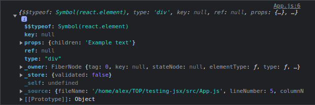

### What is JSX?

JSX es una extension para javascript que nos permite escribir etiquetas parecidas a las de HTML dentro de un archivo javascript.

No es requerido usar JSX cuando escribimos componentes React, pero si hace más conciso escribirlo.

Escensialmente es syntactic sugar para la [funcion](https://react.dev/reference/react/createElement) de React `createElement`. Esta funcion crea un elemento React, el cual es un objeto plano, por lo que JSX se compila a objetos javascript tambien.

Acá podemos ver un elemento JSX en la consola con algo de texto:



### Why do we use JSX?

La mayoria del tiempo en apps, el renderizado de la lógica y la presentacion estan acoplados, pero generalmente queremos  separarlos en archivos distintos. JSX permite a react contener tanto la lógica de la programacino como la presentacion en el mismo lugar (el componente).

Principalmente hace más intuitivo, y de manera más visual el trabajar con UI dentro de nuestro código, y permite a React mostrar mensajes de errores más utiles.

### Reglas de JSX

Si tomamos un html valido y lo copiamos directamente en elcomponente React, este no va a funcionar. Esto debido a algunas de las reglas que implementa JSX, que no estan presentes en HTML.

1. Retornar un elemento root:

    Si queremos retornar multiples elementos en un componente, podemos hacerlo envolviendo a estos en una etiqueta padre. Que puede ser un `<div>`, o, si no queremos que los elementos tengan un contenedor, podemos usar [React fragment](https://react.dev/reference/react/Fragment) de esta manera `<>Children</>`.

```jsx
    function App(){
        //podriamos reemplazar <></> con -> <div></div> 
        return(
            <>
                <h1> Example h1</h1>
                <h2> Example h2</h2>
            </>
        );
    }

```

Forma incorrecta de hacerlo:

```jsx
function App(){
    return(
        <h1> Example h1</h1>
        <h2> Example h2</h2>      
    );
}
```
2. Cerrar todas las etiquetas:

    En html, muchas etiquetas son *self-closing* y *self-wrapping*. Pero en JSX debemos cerrar y envolver estas etiquetas de manera explicita.

    `<input>` se vuelve `</input>`, y `<li>` se vuelve `<li></li>`

Manera correcta

```jsx
function App(){
    return(
        <>
            <input />
            <li></li>
        </>
    );
}
```

Manera incorrecta:
```jsx
function App(){
    return (
    <>
      <input>
      <li>
    </>
  );
}
```

3. camelCase la mayoria de las cosas

    JSX se convierte en javascript, y los atributos de los elementos se vuelves *keys* de objetos javascript. por lo que no podemos usar dashes(-) o palabras reservadas como `class`.  Debido a esto, muchos atributos HTML son escritos en camelCase. En vez de `stroke-width` usamos `strokeWidth`, y en vez de `class` usamos `className`.

manera correcta:
```jsx
function App() {
  return (
  <div className="container">
    <svg>
      <circle cx="25" cy="75" r="20" stroke="green" strokeWidth="2" />
    </svg>
  </div>
  );
}
```

manera incorrecta:

```jsx
function App() {
  return (
    <div class="container">
      <svg>
        <circle cx="25" cy="75" r="20" stroke="green" stroke-width="2" />
      </svg>
    </div>
  );
}
```

### Converting HTML to JSX

Ahora que cubrimos las reglas de JSX, veamos la conversion de un bloque de html a JSX:

```html
<h1>Test title</h1>
<svg>
  <circle cx="25" cy="75" r="20" stroke="green" stroke-width="2" />
</svg>
<form>
  <input type="text">
</form>
```

Si intentamos retornar esto de un componente React obtenendremos muhcos errores, por lo que vamos a arreglarlos:

El primer error surge debido a que no estamos retornando un sólo elemento raíz, por lo que devemos darle un container:

```JSX
<div>
  <h1>Test title</h1>
  <svg>
    <circle cx="25" cy="75" r="20" stroke="green" stroke-width="2" />
  </svg>
  <form>
    <input type="text">
  </form>
</div>
```
El otro errir está en la etiqueta `<input>`.

```jsx
<div>
  <h1>Test title</h1>
  <svg>
    <circle cx="25" cy="75" r="20" stroke="green" stroke-width="2" />
  </svg>
  <form>
    <input type="text" />
  </form>
</div>
```

Y ahora si por último debemos escribir en `camelCase` nuestros atributos, pero estamos usando propiedades DOM invalidas para JSX, especialmente `stroke-width`,

```jsx
<div>
  <h1>Test title</h1>
  <svg>
    <circle cx="25" cy="75" r="20" stroke="green" strokeWidth="2" />
  </svg>
  <form>
    <input type="text" />
  </form>
</div>
```

Ahora que ya aplicamos todos las soluciones a los errores que React nos da, de esta manera podemos usar componentes React con código JSX sin problemas.

### Assignament

Hacer los ejercicios que se ven en estas páginas

1. [Leemos la documentacion de React para reveer el contenido que vimos acá](https://react.dev/learn/writing-markup-with-jsx): checked 8)

2. [Leemos JavaScript en JSX de la documentacion](https://react.dev/learn/javascript-in-jsx-with-curly-braces)

> En este articulo nos explican como usar JavaScript en JSX para hacer un html dinamico. Generalmente vamos a insertar javasctipt usando los curly-braces `{}`. Por ejemplo, si tuviesemos una imagen que queremos que se muestre dinamicamente podemos reemplazar las string de la etiqueta `src`  y `alt`.

```jsx
export default function Avatar() {
  return (
    
  );
}
```
Esto pasaria a ser:

```jsx
export default function Avatar() {
  return (
    
  );
}
```

JSX es una manera especial de usar Javascript, por lo que nos permite escribir javascript dentro de estos archivos. 

```jsx
export default function TodoList() {
  const name = 'Gregorio Y. Zara';
  return (
    <h1>{name}'s To Do List</h1>
  );
}
```

Cualquier expresion javascript va a funcionar dentro de los curly braces, incluida la llamada a funciones como `formatDate()`:


```jsx
const today = new Date();

function formatDate(date) {
  return new Intl.DateTimeFormat(
    'en-US',
    { weekday: 'long' }
  ).format(date);
}

export default function TodoList() {
  return (
    <h1>To Do List for {formatDate(today)}</h1>
  );
}
```

***donde usar los curly braces***:

1. Como texto, directamente dentro de etiquetas JSX: <h1>{name}'s To Do List</h1> works, but <{tag}>Gregorio Y. Zara's To Do List</{tag}> will not.
2. Como atributos, inmediatamente despues de un signo `=`:  `src={avatar}` will read the avatar variable, but `src="{avatar}"` will pass the string "{avatar}".


** Doble curly braces**

Además de strings, numeros y otras expresiones de javascript podemos pasar objetos. Esto tambien están denotados con curlybraces, como `{name: "Agus p", inventions: 5 }`. Pero para poder pasarlos, necesitamos envolverlos en curlybraces: `person={{name: "Agus", incentions: 5}}

Es probable que lo veamos si necesitamos hacer inline styles de CSS, cosa que no es muy comun ya que con react se suelen usar clases:

```jsx
export default function TodoList() {
  return (
    <ul style={{
      backgroundColor: 'black',
      color: 'pink'
    }}>
      <li>Improve the videophone</li>
      <li>Prepare aeronautics lectures</li>
      <li>Work on the alcohol-fuelled engine</li>
    </ul>
  );
}
```

Otro ejemplo de como usar objetos para guardar informacion:

```jsx
const person = {
  name: 'Gregorio Y. Zara',
  theme: {
    backgroundColor: 'black',
    color: 'pink'
  }
};

export default function TodoList() {
  return (
    <div style={person.theme}>
      <h1>{person.name}'s Todos</h1>
      
      <ul>
        <li>Improve the videophone</li>
        <li>Prepare aeronautics lectures</li>
        <li>Work on the alcohol-fuelled engine</li>
      </ul>
    </div>
  );
}
```

Recap
Now you know almost everything about JSX:

JSX attributes inside quotes are passed as strings.
Curly braces let you bring JavaScript logic and variables into your markup.
They work inside the JSX tag content or immediately after = in attributes.
{{ and }} is not special syntax: it’s a JavaScript object tucked inside JSX curly braces.